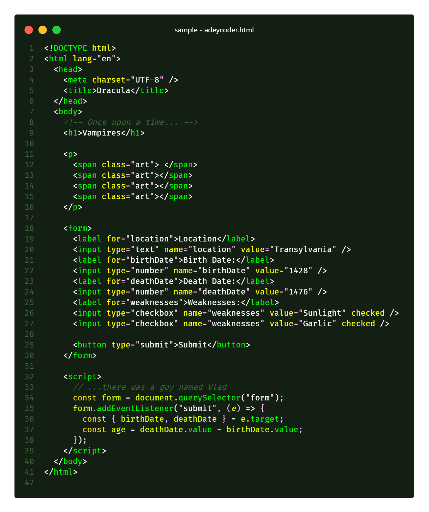

# Adey Coder Dark Theme

Adey Coder dark theme is a Green colored theme for VS Code and maintain clean and smooth coding ground.

📺 Youtube channel : [Adey Coder](https://youtube.com/c/AdeyCoder)

🔗 Links : [My Links](https://znap.link/adeycoder)

🔔 This the Testing version of **Adey Coder Dark Theme** that is on development.

# How To install

## Method 1 - Using Extension Panel

1. Open Extensions sidebar panel in VS Code. _View → Extensions_
1. Search for **Adey Coder Dark** - find the one by **Adey Coder**
1. Click **Install** to install it.
1. Code > Preferences > Color Theme > Adey Coder Dark

## Method 2 - Using Quick open

1. Launch _VS Code Quick open_ (**Ctrl+P**)
1. Paste the following command
    > ext install AdeyCoder.adey-coder-dark
1. Then press **Enter**
1. Code > Preferences > Color Theme > Adey Coder Dark

## Screenshot

Preview of theme on **HTML**, **CSS**, **JavaScript** and **PHP** and **Welcome Page**

### Welcome Page

This is how it looks the first/initial page of the VS Code.

### Preview

Preview to show how latest update has syntax highlighting for **HTML**,**CSS**,**javaScript** and **PHP** as respectively.

Thank your using 🙂

**Enjoy!**
