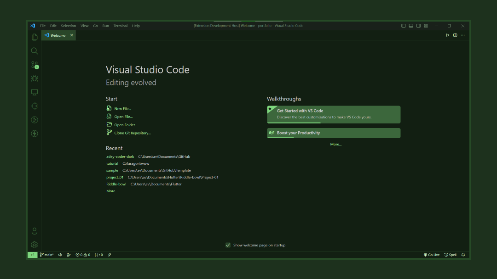
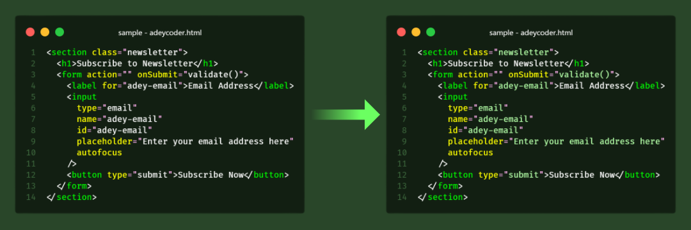
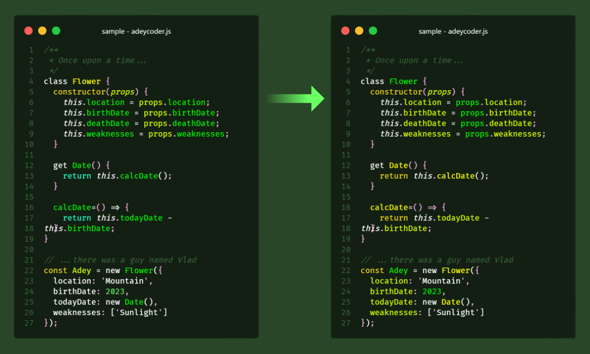

# Adey Coder Dark Theme

Adey Coder dark theme is a Green colored theme for VS Code and maintain clean and smooth coding ground. I use this theme on my youtube channel code tutorial videos. Green is my favorite color so I made this green dark theme.

- Youtube channel : [Adey Coder](https://youtube.com/c/AdeyCoder)
- Links : [My Links](https://znap.link/adeycoder)

🔔 This theme **Adey Coder Dark Theme** is still on development.

## Supported Languages

This theme have a support for languages
| Letter | Languages |
|---|---|
| **C** | C , C++ , C# , CSS , Clojure |
| **D** | Dart|
| **E** | Elixir |
| **G** | Go |
| **H** | HTML |
| **J** | Java , JavaScript |
| **K** | Kotlin |
| **M** | Markdown |
| **P** | PHP , Python |
| **R** | Ruby , Rust |
| **S** | Scala , Standard ML , Swift |
| **T** | Typescript |

## How To install

### Method 1 - Using Extension Panel

1. Open Extensions sidebar panel in VS Code. _View → Extensions_
1. Search for **Adey Coder Dark** - find the one by **Adey Coder**
1. Click **Install** to install it.
1. Code > Preferences > Color Theme > Adey Coder Dark

### Method 2 - Using Quick open

1. Launch _VS Code Quick open_ (**Ctrl+P**)
1. Paste the following command
    > ext install AdeyCoder.adey-coder-dark
1. Then press **Enter**
1. Code > Preferences > Color Theme > Adey Coder Dark

## Screenshot

Preview of theme on **Welcome Page** , **HTML**and**JavaScript**

### Welcome Page

This is how it looks the first/initial page of the VS Code.

### Preview

Preview to show how latest update has syntax highlighting

Thank your using 🙂

**Enjoy!**
