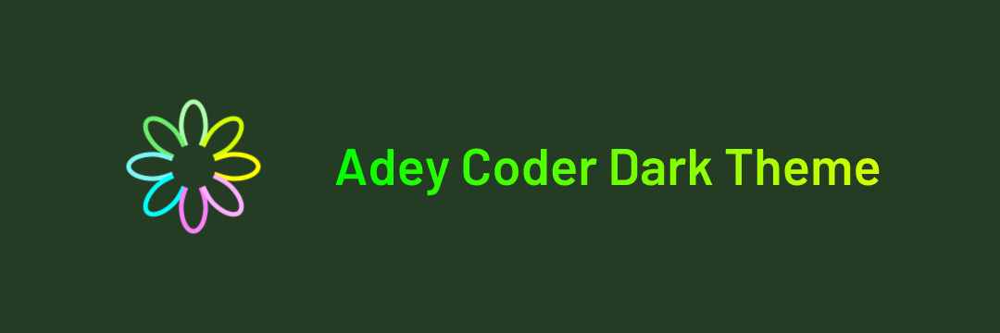
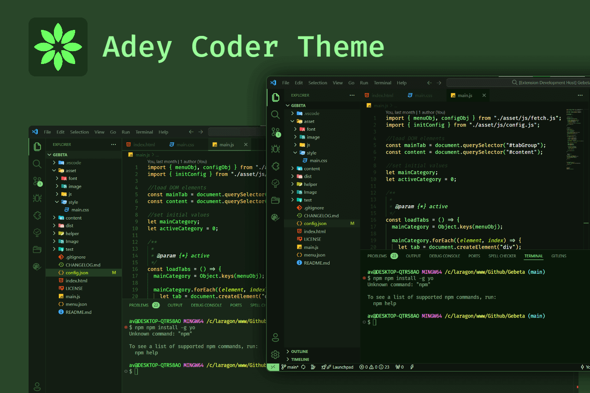

# Adey Coder Theme

Adey Coder dark theme is a Green colored theme for VS Code and maintain clean and smooth coding ground. I use this theme on my [Youtube channel](https://youtube.com/@AdeyCoder) code tutorial videos. Green is my favorite color so I made this green dark theme.

**Adey Coder Theme** contains 2 themes

1. Adey Coder
1. Adey Coder - Deep dark ✨ **NEW** ✨

## Supported Languages

The following are support for languages that are tested.

- **C** : C , C++ , C# , CSS , Clojure
- **D** : Dar
- **E** : Elixir
- **G** : Go
- **H** : HTML
- **J** : Java , JavaScript
- **K** : Kotlin
- **M** : Markdown
- **P** : PHP , Python
- **R** : Ruby , Rust
- **S** : Scala , Standard ML , Swift
- **T** : Typescript

## More

You can subscribe to youtube channel and other links

- Youtube channel : [Adey Coder](https://youtube.com/@AdeyCoder)
- Links : [My Links](https://adeycoder.bio.link)
- Support My work : [Patreon](https://www.patreon.com/adeycoder) - [Ko-fi](https://ko-fi.com/adeycoder) - [Buy Me a Coffee](https://buymeacoffee.com/adeycoder)

## Preview

Thank your using 🙂

**Enjoy!**
