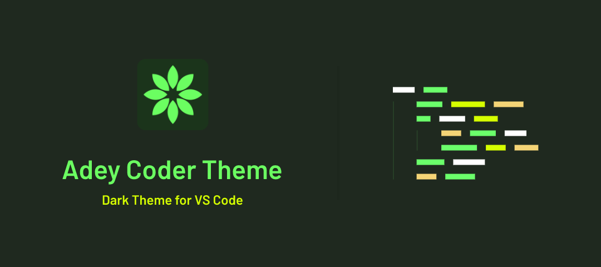

# Adey Coder Dark Theme

Adey Coder dark theme is a Green colored theme for VS Code and maintain clean and smooth coding ground. I use this theme on my [Youtube channel](https://youtube.com/@AdeyCoder) code tutorial videos. Green is my favorite color so I made this green dark theme.

- Youtube channel : [Adey Coder](https://youtube.com/@AdeyCoder)
- Links : [My Links](https://znap.link/adeycoder)
- Support My work : [Patreon](https://www.patreon.com/adeycoder) - [Ko-fi](https://ko-fi.com/adeycoder)

🔔 This theme **Adey Coder Dark Theme** is still on development.

## Supported Languages

The following are support for languages that are tested.
| Letter | Languages |
|:---:|:---|
| **C** | C , C++ , C# , CSS , Clojure |
| **D** | Dart|
| **E** | Elixir |
| **G** | Go |
| **H** | HTML |
| **J** | Java , JavaScript |
| **K** | Kotlin |
| **M** | Markdown |
| **P** | PHP , Python |
| **R** | Ruby , Rust |
| **S** | Scala , Standard ML , Swift |
| **T** | Typescript |

## How To install

### 1 - Using Extension Panel

1. Open Extensions sidebar panel in VS Code. _View → Extensions_
1. Search for **Adey Coder Dark** - find the one by **Adey Coder**
1. Click **Install** to install it.
1. Code > Preferences > Color Theme > Adey Coder Dark

### 2 - Using Quick open

You can also install using Launch _VS Code Quick open_ (**Ctrl+P**), Paste the following command

> ext install AdeyCoder.adey-coder-dark

Then press **Enter**

### Preview

Preview to show how latest update

Thank your using 🙂

**Enjoy!**
